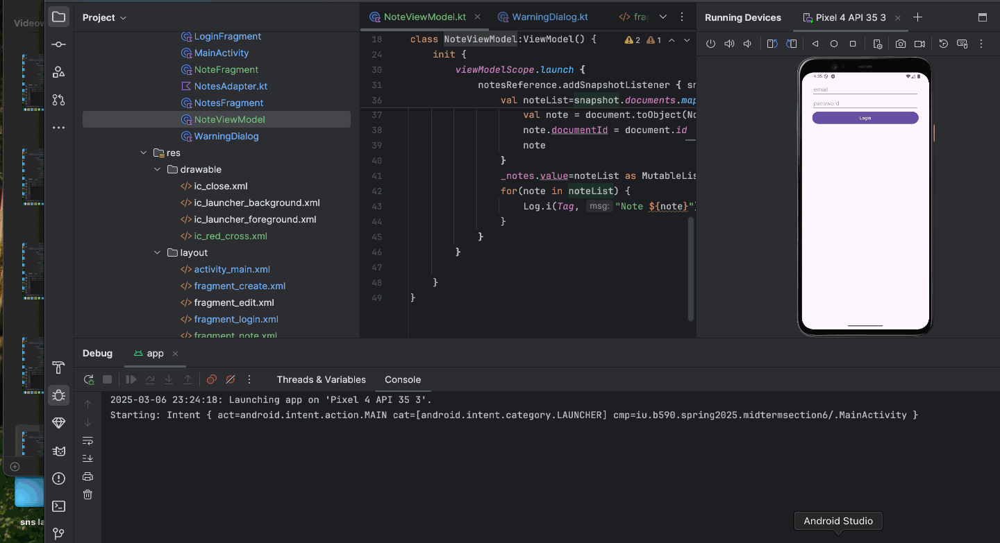

# Project1
Simple Notes App

# Description
The Notes app is used to add the notes we want and also delte when it is not important

## Functionality 

The following **required** functionality is completed:

The Users sees the calculator app with the Text View with the default value as 0 and also buttons to perform operations.
A calculator icon is added into the starting instead of android icon
1. User logs into the app using credentials
2. Users goes to notes page and clicks add notes and then redirects to note page
3. User can type the tite and description and save which again redirects to notes page
4. User can edit the title or task by clicking on it and after updation it updates theh same title
5. User can also remove the task by clicking on X mark and it will ask whether to remove or not 
6. User can also logout using logout button

The following **extensions** are implemented:

I’ve used the enableEdgeToEdge() function to enable a full-screen immersive layout that removes the status bar.
The extensions used in the code are libs.plugins.android.application for the Android application plugin and libs.plugins.kotlin.android for Kotlin support in Android. 

## Video Walkthrough

Here's a walkthrough of implemented user stories:

GIF created with [LiceCap](http://www.cockos.com/licecap/).

## Challenges and Notes

1. Editing the user title is bit of a task which is achieved.
2. Adding a dialogue box is a hectic task but have achieved them

## License

    Copyright [2025] [Rajesh Kumar Reddy Avula]

    Licensed under the Apache License, Version 2.0 (the "License");
    you may not use this file except in compliance with the License.
    You may obtain a copy of the License at

        http://www.apache.org/licenses/LICENSE-2.0

    Unless required by applicable law or agreed to in writing, software
    distributed under the License is distributed on an "AS IS" BASIS,
    WITHOUT WARRANTIES OR CONDITIONS OF ANY KIND, either express or implied.
    See the License for the specific language governing permissions and
    limitations under the License.
